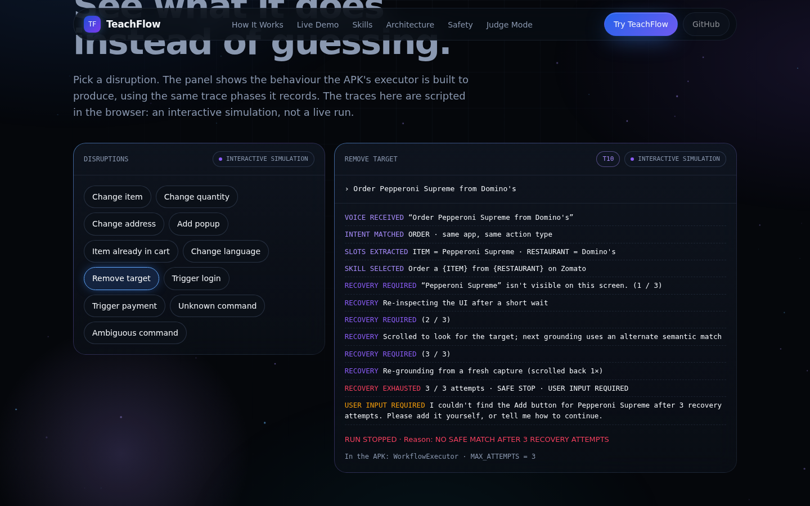
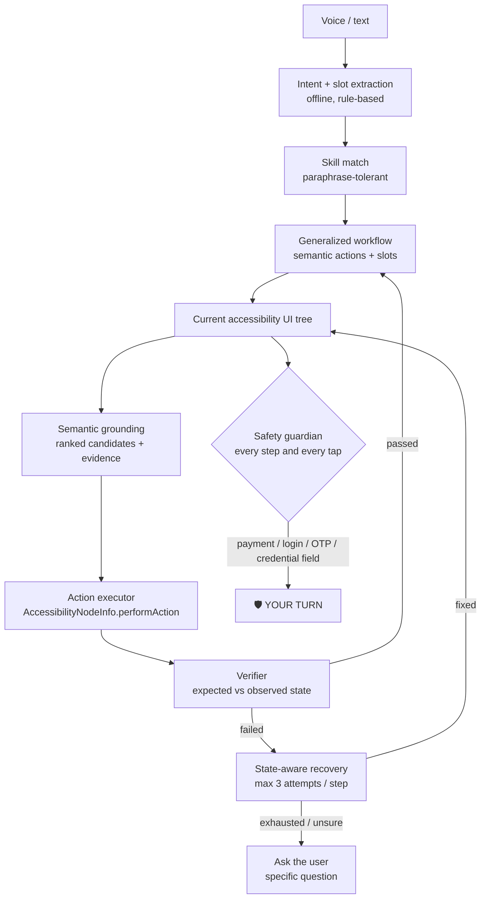

# TeachFlow

**Teach once. Say it naturally. Let Android act.**

TeachFlow is an Android agent that learns a task from **one demonstration**, turns it into a reusable **parameterized skill**, and later runs it from a **natural-language command**. It re-finds every button on the *current* screen by meaning, verifies each step, recovers from small UI changes, asks when it isn't sure, and **always hands control back at payment and sign-in**.

> TeachFlow learns what the user is trying to accomplish, not merely where the user tapped.

Samsung PRISM Generative AI Hackathon 2026–27.

| | What it is | Status |
|---|---|---|
| [`/android`](android) | **LIVE PROTOTYPE.** A real Android app using `AccessibilityService` and `AccessibilityNodeInfo` to observe and operate third-party apps. | Builds automatically on GitHub Actions ([download APK](https://github.com/sistlapriya/teachflow/releases/tag/apk-latest)). Logic-tested off-device. **Device tests: NOT YET TESTED.** |
| [`/web`](web) | Judge-facing website. Every interactive demo on it is labelled **INTERACTIVE SIMULATION**. Judge Mode imports real results exported by the APK. | Browser-tested |
| [`/docs`](docs) | Architecture, testing guide, presentation content, audit, submission checklist, screenshots | |
| [`/demo`](demo) | 5-minute demo script and copy-paste commands | |



---

## Quick start

1. Install the APK: download `teachflow-debug.apk` from the [latest release](https://github.com/sistlapriya/teachflow/releases/tag/apk-latest) (or build it, see [Setup](#4-setup)).
2. Enable the **TeachFlow** Accessibility Service.
3. Open a supported target app (Zomato or Amazon) once and sign in yourself.
4. In TeachFlow, give the voice command (🎙 Speak) or type it, e.g. *"Order a Margherita pizza from Domino's on Zomato."*
5. Select **Teach new skill**.
6. Perform the task once, normally, and stop at checkout. TeachFlow also stops by itself at payment or sign-in.
7. Review the generated skill: parameters, semantic actions, and the relevance of each observed action.
8. **Save**.
9. Give a paraphrased or parameterized command, e.g. *"Get me a farmhouse from dominos"* or *"Order two Margherita pizzas from Domino's."*
10. Observe the replay in the floating panel.
11. At payment or authentication, control returns to you (**YOUR TURN**).

---

## 1. Problem

Voice assistants understand commands but cannot reliably operate arbitrary third-party apps. Existing automation relies on screen coordinates, hand-written scripts or app-specific integrations. These break when a button moves or a popup appears, and most people can't write them.

## 2. Solution

People can *show* a task even if they can't script it. TeachFlow:

1. **Teaches** from one demonstration, captured through Android accessibility events and UI trees.
2. **Generalizes** by separating the task structure from the values in it: *Order {ITEM} from {RESTAURANT}*.
3. **Executes** by grounding each semantic action on the current screen. It never replays coordinates.
4. **Verifies** the expected state after every important action.
5. **Recovers** from popups, already-done states and moved targets, making at most 3 attempts per step.
6. **Stops safely** at payment, OTP, password, PIN and biometric prompts. Your turn.

## 3. Architecture



Details: [`docs/architecture.md`](docs/architecture.md).

**Stack:** Kotlin 2.0 · Jetpack Compose · Coroutines/Flow · AccessibilityService · JSON persistence in app-private storage · the system speech recogniser (RecognizerIntent). No network access, no LLM, no API keys.

## 4. Setup

**Download (easiest):** get `teachflow-debug.apk` from the [**apk-latest** release](https://github.com/sistlapriya/teachflow/releases/tag/apk-latest). GitHub Actions ([`.github/workflows/build-apk.yml`](.github/workflows/build-apk.yml)) builds it automatically from `main` whenever the Android code changes. Copy it to an Android 8.0+ phone and open it (allow "Install unknown apps" when asked), or run `adb install teachflow-debug.apk`.

**Build it yourself:** open [`/android`](android) in Android Studio (Ladybug or newer) → **Build → Build APK(s)**, or run `gradle assembleDebug` in `android/` with Gradle 8.9 and JDK 17.

Then install **Zomato** and/or **Amazon** and sign in to them yourself. Save *Home* and *Work* addresses in Zomato if you want to test addresses.

## 5. Android Accessibility permission

Settings → Accessibility → Installed apps (or *Downloaded apps*) → **TeachFlow** → On.

On **Android 13+**, sideloaded apps get a greyed-out toggle marked "Restricted setting". Go to Settings → Apps → TeachFlow → ⋮ → **Allow restricted settings**, then enable it. The onboarding screen links to this page.

TeachFlow reads the on-screen UI tree of the app in front. It never records, stores or types into password, OTP, PIN, CVV or card fields. Those values are replaced with `[REDACTED]` at capture time.

## 6. How to teach a skill

1. On Home, say or type the full task: *"Order a Margherita pizza from Domino's on Zomato."*
2. Tap **Teach new skill**. TeachFlow opens the app from its start screen, and the floating panel shows **● LEARNING**.
3. Do the task once: search the item, open the restaurant, tap ADD, open the cart.
4. Tap **Stop teaching** at checkout, or let TeachFlow stop automatically at payment or sign-in.
5. **Review.** Every observed action is labelled **RELEVANT**, **UNCERTAIN** or **IRRELEVANT**, with its reason. A declined phone call, a detour or a popup dismissal is discarded. You also see the parameters and semantic actions, and you can rename the skill.
6. **Save.** The skill is written to on-device skill memory and survives restarts.

The generated workflow is a list of semantic actions, never coordinates:

```
OPEN SEARCH → SEARCH {ITEM} → SELECT RESTAURANT {RESTAURANT} → ADD {ITEM} TO CART
→ SET QUANTITY {QUANTITY} (optional) → OPEN CART → SELECT ADDRESS {ADDRESS} (optional) → STOP_AT_PAYMENT
```

## 7. How to replay

Say or type a command and tap **Run**. TeachFlow matches it to a skill by meaning, not wording: app, action type, compatible slots and shared words. It shows the match score (a heuristic, not a probability) with its reasons. It then opens the app, and the floating panel shows each step. **Take control** pauses at any time, and **Resume** continues.

## 8. Parameterization

| Command | Parameters |
|---|---|
| Order a Margherita pizza from Domino's on Zomato | ITEM = Margherita pizza · RESTAURANT = Domino's |
| Order a Farmhouse pizza from Domino's | ITEM = Farmhouse pizza (same workflow) |
| Order **two** Margherita pizzas from Domino's | QUANTITY = 2 → SET QUANTITY step runs and is verified |
| Order a Margherita from Domino's, **deliver to work** | ADDRESS = Work → SELECT ADDRESS step runs |
| Search for **a phone case** on Amazon and add the first result to cart | ITEM = phone case; the product is chosen by **position** (#1), not by title |

Missing or vague details are **asked for, never guessed**:

- *"Order pizza from Domino's"* → "I can do that. Which pizza would you like?"
- *"Order a Margherita"* → "Which restaurant should I use?" (during the run, when the step needs it).

You can pick an on-screen option, tap the taught value, or type or say an answer. The trace records `PARAMETER RESOLVED ✓`. An address is never assumed unless you taught or said it.

## 9. Recovery

Before recovering, TeachFlow classifies the screen: `POPUP · ALREADY_COMPLETED · MISSING_TARGET · EMPTY_RESULTS · NETWORK_BLOCK · UNKNOWN_STATE · AMBIGUOUS_STATE · LOGIN · OTP · PAYMENT`. The response depends on the state:

- A safe popup is dismissed (Close / Not now / Skip).
- An item already in the cart is skipped and verified.
- A missing target gets: attempt 1, re-inspect or submit the search; attempt 2, scroll and try an alternate semantic match; attempt 3, re-ground from a fresh capture.

After **3 attempts per step**, it stops safely: **RECOVERY EXHAUSTED · 3 / 3 ATTEMPTS · SAFE STOP · USER INPUT REQUIRED**, with a specific question, for example *"I couldn't find the Add button for Pepperoni Supreme after 3 recovery attempts."* It never taps at random and never loops.

## 10. Safety boundary

- Rules are deterministic (`SafetyGuardian`). No model decides what is safe.
- Checks run before every step, before every tap, and on the screen each tap produces.
- **Payment**: 🛡 SAFETY BOUNDARY · PAYMENT SCREEN DETECTED · Automation has stopped · YOUR TURN. The run report says *stopped at payment*. Nothing claims a payment was made.
- **Login, password, OTP, PIN, biometric**: AUTHENTICATION REQUIRED · YOUR TURN. It continues only when you tap **Resume**, and then re-verifies the screen.
- It never types into, captures or submits credentials.

## 11. Target apps

| App | Workflow | Status |
|---|---|---|
| Zomato | Order food: item, restaurant, quantity, address | Primary target. Device tests NOT YET TESTED |
| Amazon | Search and add the first result to cart | Secondary target. Device tests NOT YET TESTED |
| Any other app | "Try in another app" for a saved skill | **EXPERIMENTAL**: not validated, never counted in skill statistics |

Nothing in the code is specific to these apps. No package names, labels or test commands are hardcoded. Every workflow comes from a demonstration.

## 12. Known limitations

- **Not yet run on a physical device.** All device-level results are NOT YET TESTED.
- Commands must be in English. The parser is rule-based and offline.
- Semantic roles and verification checks are heuristics. For example, "cart opens" looks for words like *cart, bill, total*. Apps with unlabelled custom views may expose too little, and TeachFlow then asks instead of guessing.
- Quantity and address steps need the app to expose a "+" control and a saved-address list to accessibility.
- A skill taught on one app version may need re-teaching after a major redesign.
- Cross-app transfer is experimental and unvalidated.

## 13. Testing

- **Device tests (T1–T14):** follow [`docs/testing.md`](docs/testing.md). Record each result in the app (**Tests** tab: status, observation, attach the run). Then use **Export results JSON** and import it on the website's Judge Mode. All tests are currently **NOT YET TESTED**.
- **Off-device logic check:** [`android/tools/logic-check/run.sh`](android/tools/logic-check/run.sh). It runs the parser, matcher, relevance filter, synthesizer and grounder on synthetic screens, and drives the real `WorkflowExecutor` against a scripted fake app in 13 scenarios. It fails if any scenario touches a credential field or the payment button. The latest output is in [`docs/test-results/logic-check-output.txt`](docs/test-results/logic-check-output.txt). This shows the logic behaves as designed; it is not a device result.
- **Audit:** [`docs/audit.md`](docs/audit.md) lists what was checked, the bugs found and fixed, and what remains untested.

## 14. Demo

The 5-minute sequence (teach → exact replay → paraphrase → changed item → quantity → popup → stuck → safety stop) is in [`demo/demo-script.md`](demo/demo-script.md), with copy-paste commands in [`demo/commands.md`](demo/commands.md). The presentation content is in [`docs/presentation.md`](docs/presentation.md).

## 15. Team

_Add team member names, roles and contact here._

---

MIT License. See [LICENSE](LICENSE). This repository contains no credentials, API keys or secrets.
