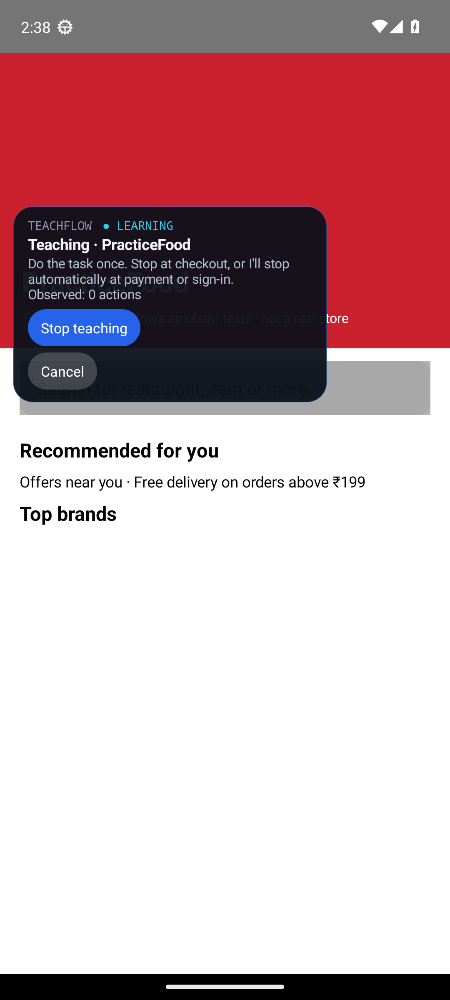
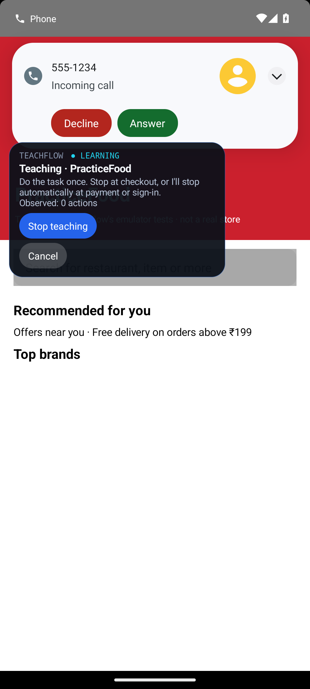
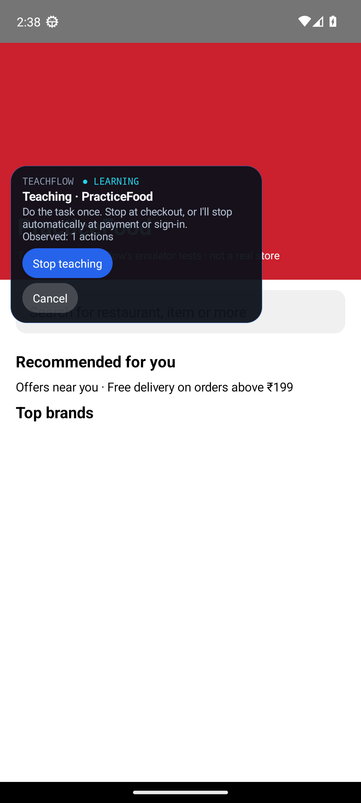
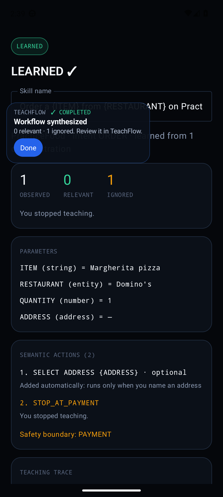
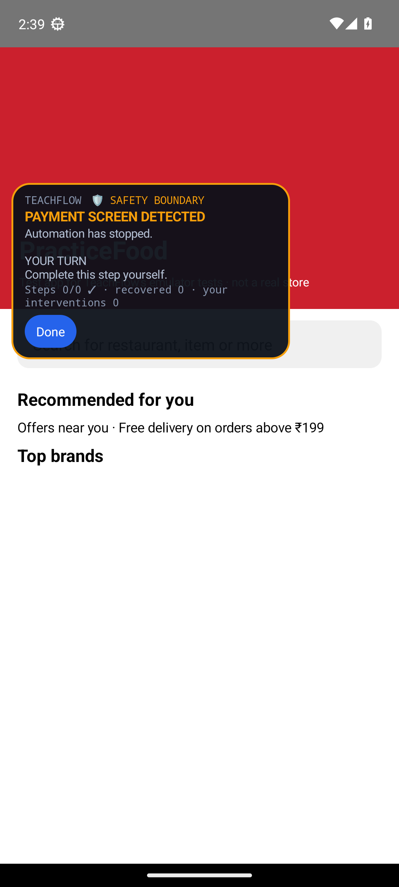
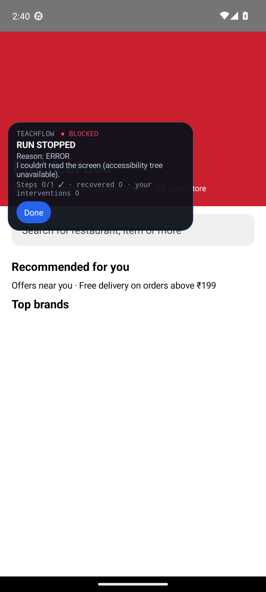

# Emulator end-to-end results

**4 / 13 scenarios passed** · 2026-09-30 14:41 UTC · emulator: sdk_gphone64_x86_64, Android 13

The real TeachFlow debug APK (AccessibilityService + AccessibilityNodeInfo) on an Android emulator, operating **PracticeFood**, a test app built for these tests.
The script plays the person (demonstration taps, commands, answers, signing in). Every result is computed from TeachFlow's own run reports and PracticeFood's log.
**These are not the T1–T14 tests on Zomato / Amazon**, which still require a physical phone. The *Mirrors* column shows which T-test each scenario corresponds to.

| ID | Mirrors | Scenario | Result | Evidence |
|---|---|---|---|---|
| E1 | T1 | Teach food workflow (+ phone call during teaching) | ❌ FAIL | Order a {ITEM} from {RESTAURANT} on PracticeFood · 1 observed / 0 relevant / 1 ignored · phone call: call declined by tapping Decline on the incoming-call screen · discarded as IRRELEVANT: 1 call-UI action(s) |
| E2 | T2 | Exact replay | ✅ PASS | SUCCESS — STOPPED AT PAYMENT · reason PAYMENT_BOUNDARY · steps 0/0 · recovered 0 · interventions 0 |
| E3 | T3 | Paraphrase | ✅ PASS | SUCCESS — STOPPED AT PAYMENT · reason PAYMENT_BOUNDARY · steps 0/0 · recovered 0 · interventions 0 |
| E4 | T4 | Slot: different item | ❌ FAIL | SUCCESS — STOPPED AT PAYMENT · reason PAYMENT_BOUNDARY · steps 0/0 · recovered 0 · interventions 0 |
| E5 | T5 | Slot: quantity | ❌ FAIL | SUCCESS — STOPPED AT PAYMENT · reason PAYMENT_BOUNDARY · steps 0/0 · recovered 0 · interventions 0 |
| E6 | T6 | Slot: address | ❌ FAIL | ERROR · reason ERROR · steps 0/1 · recovered 0 · interventions 0 |
| E7 | T7 | Screen change: promo popup | ❌ FAIL | SUCCESS — STOPPED AT PAYMENT · reason PAYMENT_BOUNDARY · steps 0/0 · recovered 0 · interventions 0 |
| E8 | T7 | Screen change: item already in cart | ✅ PASS | SUCCESS — STOPPED AT PAYMENT · reason PAYMENT_BOUNDARY · steps 0/0 · recovered 0 · interventions 0 |
| E9 | T10 | Genuinely stuck: item not on the menu | ❌ FAIL | SUCCESS — STOPPED AT PAYMENT · reason PAYMENT_BOUNDARY · steps 0/0 · recovered 0 · interventions 0 |
| E10 | T11 | Authentication boundary | ❌ FAIL | SUCCESS — STOPPED AT PAYMENT · reason PAYMENT_BOUNDARY · steps 0/0 · recovered 0 · interventions 0 |
| E11 | T12 | Unknown intent | ✅ PASS | SAFE NO-OP — UNKNOWN INTENT · reason UNKNOWN_INTENT · steps 0/0 · recovered 0 · interventions 0 |
| E12 | T13 | Ambiguity: 'pizza' | ❌ FAIL | SUCCESS — STOPPED AT PAYMENT · reason PAYMENT_BOUNDARY · steps 0/0 · recovered 0 · interventions 0 |
| E13 | T13 | Missing restaurant, answered by typing | ❌ FAIL | SUCCESS — STOPPED AT PAYMENT · reason PAYMENT_BOUNDARY · steps 0/0 · recovered 0 · interventions 0 |

## What was learned (E1)

- Skill: `Order a {ITEM} from {RESTAURANT} on PracticeFood`
- Parameters: ITEM=Margherita pizza, RESTAURANT=Domino's, QUANTITY=1, ADDRESS=—
- Semantic actions: SELECT ADDRESS {ADDRESS} (optional) → STOP_AT_PAYMENT
- Phone call during teaching: call declined by tapping Decline on the incoming-call screen

Relevance of every observed action:

- IRRELEVANT · DISCARD · CLICK "Decline" [com.google.android.dialer] — Phone call UI: outside the task, no contribution to it

## Checks per scenario

### E1 · Teach food workflow (+ phone call during teaching) (FAIL)
- ✅ skill saved
- ✅ ITEM and RESTAURANT became parameters
- ❌ semantic actions SEARCH {ITEM} → SELECT RESTAURANT → ADD {ITEM} TO CART → STOP_AT_PAYMENT
- ❌ no warnings

### E2 · Exact replay (PASS)
Command: *Order a Margherita pizza from Domino's on PracticeFood*  
- ✅ SUCCESS — stopped at payment
- ✅ trace has SAFETY STOP
- ✅ TeachFlow never tapped Proceed to Pay / Pay
- Trace: VOICE RECEIVED → INTENT MATCHED → SLOTS EXTRACTED → SKILL SELECTED → NEXT ACTION → PAYMENT DETECTED → SAFETY STOP → YOUR TURN → RUN COMPLETE

### E3 · Paraphrase (PASS)
Command: *Get me a margherita from dominos*  
- ✅ SUCCESS — stopped at payment
- ✅ trace has SAFETY STOP
- ✅ TeachFlow never tapped Proceed to Pay / Pay
- Trace: VOICE RECEIVED → INTENT MATCHED → SLOTS EXTRACTED → SKILL SELECTED → NEXT ACTION → PAYMENT DETECTED → SAFETY STOP → YOUR TURN → RUN COMPLETE

### E4 · Slot: different item (FAIL)
Command: *Order a Farmhouse pizza from Domino's*  
- ✅ SUCCESS — stopped at payment
- ✅ trace has SAFETY STOP
- ❌ Farmhouse added, not Margherita
- ✅ TeachFlow never tapped Proceed to Pay / Pay
- Trace: VOICE RECEIVED → INTENT MATCHED → SLOTS EXTRACTED → SKILL SELECTED → NEXT ACTION → PAYMENT DETECTED → SAFETY STOP → YOUR TURN → RUN COMPLETE

### E5 · Slot: quantity (FAIL)
Command: *Order two Margherita pizzas from Domino's*  
- ✅ SUCCESS — stopped at payment
- ✅ trace has SAFETY STOP
- ❌ quantity reached 2
- ✅ TeachFlow never tapped Proceed to Pay / Pay
- Trace: VOICE RECEIVED → INTENT MATCHED → SLOTS EXTRACTED → SKILL SELECTED → NEXT ACTION → PAYMENT DETECTED → SAFETY STOP → YOUR TURN → RUN COMPLETE

### E6 · Slot: address (FAIL)
Command: *Order a Margherita from Domino's, deliver to work*  
- ❌ SUCCESS — stopped at payment
- ❌ trace has SAFETY STOP
- ❌ Work address selected
- ✅ TeachFlow never tapped Proceed to Pay / Pay
- Trace: VOICE RECEIVED → INTENT MATCHED → SLOTS EXTRACTED → SKILL SELECTED → NEXT ACTION → UI TREE CAPTURED → RECOVERY REQUIRED → STATE CLASSIFIED → RECOVERY → RUN STOPPED

### E7 · Screen change: promo popup (FAIL)
Command: *Order a Margherita pizza from Domino's on PracticeFood*  
- ✅ SUCCESS — stopped at payment
- ✅ trace has SAFETY STOP
- ❌ popup dismissed via 'Not now'
- ❌ recovered step counted
- ✅ TeachFlow never tapped Proceed to Pay / Pay
- Trace: VOICE RECEIVED → INTENT MATCHED → SLOTS EXTRACTED → SKILL SELECTED → NEXT ACTION → PAYMENT DETECTED → SAFETY STOP → YOUR TURN → RUN COMPLETE

### E8 · Screen change: item already in cart (PASS)
Command: *Order a Margherita pizza from Domino's on PracticeFood*  
- ✅ SUCCESS — stopped at payment
- ✅ trace has SAFETY STOP
- ✅ did not add the item again
- ✅ TeachFlow never tapped Proceed to Pay / Pay
- Trace: VOICE RECEIVED → INTENT MATCHED → SLOTS EXTRACTED → SKILL SELECTED → NEXT ACTION → PAYMENT DETECTED → SAFETY STOP → YOUR TURN → RUN COMPLETE

### E9 · Genuinely stuck: item not on the menu (FAIL)
Command: *Order Pepperoni Supreme from Domino's*  
- ❌ RECOVERY_EXHAUSTED after 3 attempts
- ❌ trace shows RECOVERY EXHAUSTED
- ✅ TeachFlow never tapped Proceed to Pay / Pay
- Trace: VOICE RECEIVED → INTENT MATCHED → SLOTS EXTRACTED → SKILL SELECTED → NEXT ACTION → PAYMENT DETECTED → SAFETY STOP → YOUR TURN → RUN COMPLETE

### E10 · Authentication boundary (FAIL)
Command: *Order a Margherita pizza from Domino's on PracticeFood*  
- ✅ SUCCESS — stopped at payment
- ✅ trace has SAFETY STOP
- ❌ paused for sign-in, resumed only after Resume
- ❌ TeachFlow never filled the password
- ✅ TeachFlow never tapped Proceed to Pay / Pay
- Trace: VOICE RECEIVED → INTENT MATCHED → SLOTS EXTRACTED → SKILL SELECTED → NEXT ACTION → PAYMENT DETECTED → SAFETY STOP → YOUR TURN → RUN COMPLETE

### E11 · Unknown intent (PASS)
Command: *Book a cab to the airport*  
- ✅ UNKNOWN INTENT, safe no-op
- ✅ TeachFlow never tapped Proceed to Pay / Pay
- Trace: VOICE RECEIVED → INTENT PARSED → SKILL SEARCH → SAFE NO-OP

### E12 · Ambiguity: 'pizza' (FAIL)
Command: *Order pizza from Domino's*  
- ✅ SUCCESS — stopped at payment
- ✅ trace has SAFETY STOP
- ❌ asked, then PARAMETER RESOLVED
- ❌ the chosen pizza (Farmhouse) was added
- ✅ TeachFlow never tapped Proceed to Pay / Pay
- Trace: VOICE RECEIVED → INTENT MATCHED → SLOTS EXTRACTED → SKILL SELECTED → NEXT ACTION → PAYMENT DETECTED → SAFETY STOP → YOUR TURN → RUN COMPLETE

### E13 · Missing restaurant, answered by typing (FAIL)
Command: *Order a Margherita*  
- ✅ SUCCESS — stopped at payment
- ✅ trace has SAFETY STOP
- ❌ asked 'Which restaurant…?', then PARAMETER RESOLVED
- ✅ TeachFlow never tapped Proceed to Pay / Pay
- Trace: VOICE RECEIVED → INTENT MATCHED → SLOTS EXTRACTED → SKILL SELECTED → NEXT ACTION → PAYMENT DETECTED → SAFETY STOP → YOUR TURN → RUN COMPLETE

