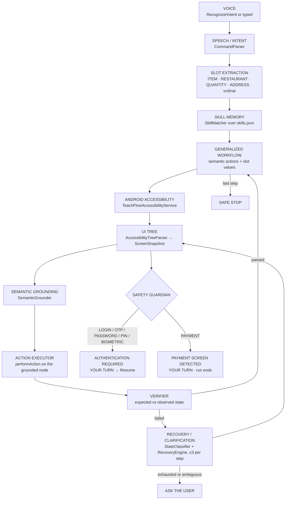
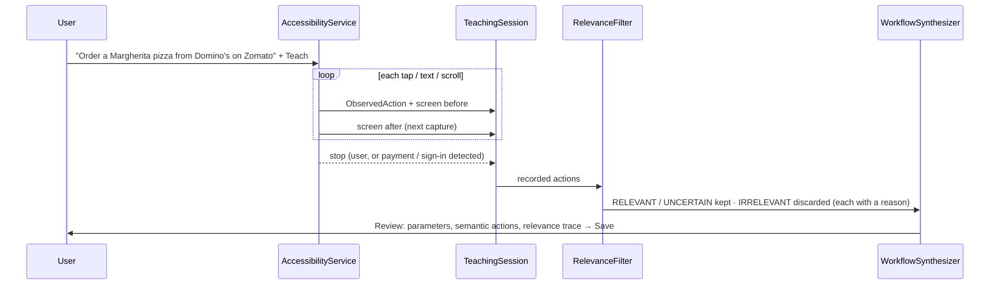
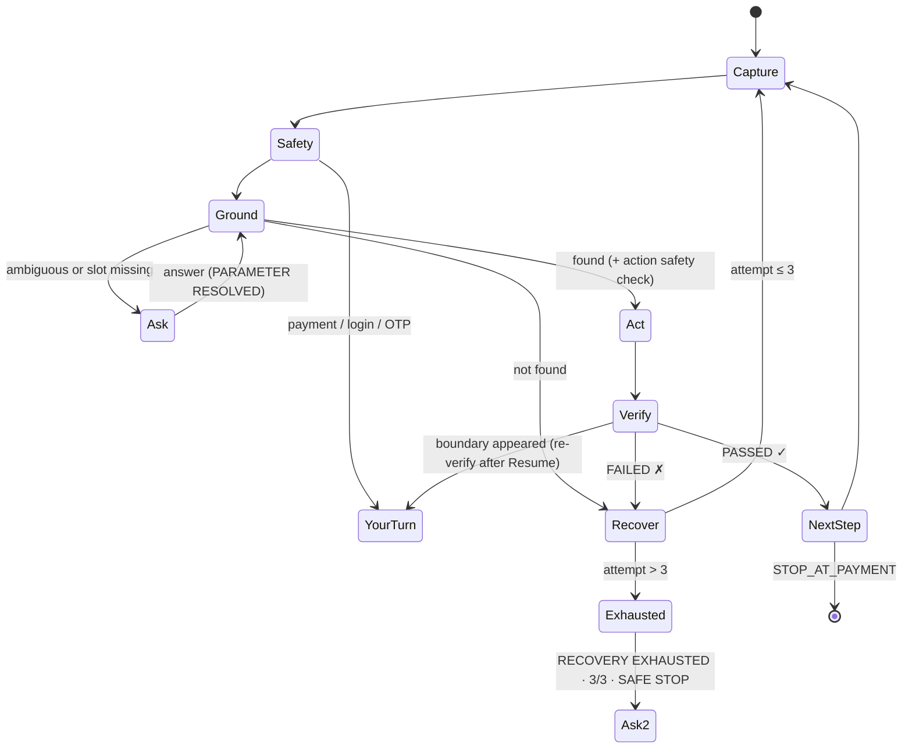

# TeachFlow architecture

Everything runs on the phone, offline. Package `com.teachflow.agent` (Kotlin, minSdk 26, targetSdk 35).

## Overview

## Modules

| Package | Responsibility |
|---|---|
| `accessibility` | `TeachFlowAccessibilityService` is the agent. `AccessibilityTreeParser` turns the node tree into a `ScreenSnapshot`: text, description, class, resource id, clickable / editable / scrollable / enabled / visible, bounds, parent and child links, semantic role with evidence, and credential redaction. `ActionObserver` turns click, long-click, text and scroll events into `ObservedAction`s, coalescing typing and flings. |
| `nlu` | `CommandParser`: offline intent and slot extraction. `TextMatch`: normalisation (so Domino's = dominos) and weighted, prefix-tolerant similarity. `AppResolver`: launchable apps and fresh launches. |
| `learning` | `TeachingSession` holds each recorded action, the screen it happened on, and the screen it led to. `RelevanceFilter` classifies each action as RELEVANT, UNCERTAIN or IRRELEVANT. `WorkflowSynthesizer` turns the demonstration into a semantic workflow. |
| `skills` | The `Skill` model, JSON persistence (`skills.json`, atomic writes), and `SkillMatcher` (paraphrase matching with reasons, ambiguity, missing-detail detection). |
| `execution` | `WorkflowExecutor` (ground → act → verify → recover loop), `SemanticGrounder`, `ActionExecutor` (the real `UiActions`), and `RunReport` / `RunReportStore` (`runs.json`). |
| `recovery` | `StateClassifier` (11 screen states) and `RecoveryEngine` (safe dismiss, already-done detection, scrolling). |
| `safety` | `SafetyGuardian`: deterministic screen and action checks. |
| `evaluation` | `JudgeResults`: the T1–T14 checklist, metrics, and the `teachflow-judge-results/1` export the website imports. |
| `ui` | Compose screens (Onboarding, Home, Review, Skills, History, Diagnostics, Tests), the floating `OverlayController`, and `AnswerActivity` for typed or spoken mid-run answers. |

## 1. Voice → intent

Voice goes through the device's speech recogniser (`RecognizerIntent`), so TeachFlow needs no microphone permission; text input is always available. `CommandParser` maps verb phrases to families (*order, get me, I want, buy* → ORDER; *search for, find* → SEARCH; *add* → ADD; *book* → BOOK), with no network and no model.

## 2. Intent → slots

- **App:** a launcher label, preferably after *on / in / using*.
- **ADDRESS:** *deliver to X*, *to work / home / office*.
- **RESTAURANT:** *from X*.
- **QUANTITY:** digits or number words inside the item phrase.
- **ITEM:** the object of the first verb.
- **Ordinal:** *the first result*.

Example: "Order two Margherita pizzas from Domino's and deliver to work" → ITEM = Margherita pizzas, QUANTITY = 2, RESTAURANT = Domino's, ADDRESS = Work.

**Skill matching** scores each skill on the same app (or none named), the same action type, slot compatibility (and whether the RESTAURANT or ITEM equals the taught value), and shared content words. Below 0.5 the result is **UNKNOWN INTENT**, a safe no-op. When two skills are within 0.05, TeachFlow asks **WHICH WORKFLOW?** Scores are heuristic evidence sums, shown with their reasons, and are not probabilities.

## 3. Skill synthesis

**Relevance** combines three explainable signals:

1. **Task context:** was the action in the target app, or in a phone call, system UI, the launcher or another app?
2. **Semantic link:** does the element mention a value from the command, or play a task role (search, product, add, cart, quantity, address)?
3. **State-transition contribution:** did it move the app to a state the task continued from, was it a detour (opened something, then came back), or did it have no visible effect?

A tap with no effect and no link is **UNCERTAIN**: it is kept and flagged in the review.

| Demonstrated | Stored as |
|---|---|
| Typed "Margherita" (spoken ITEM "Margherita pizza") | `SEARCH {ITEM}` |
| Tapped "Domino's Pizza · 30 min" | `SELECT RESTAURANT {RESTAURANT}` |
| Tapped ADD next to "Margherita Pizza" | `ADD {ITEM} TO CART` (the ADD nearest the item) |
| Tapped the first product ("add the first result") | `SELECT RESULT #1` (by position) |
| Tapped + / − | one `SET QUANTITY {QUANTITY}` step |
| Scrolled | folded: replay scrolls only if the target isn't visible |
| Dismissed a popup | discarded: popups are handled by recovery at run time |
| Declined a phone call | discarded: phone-call UI |
| Tapped "Proceed to pay" | `STOP_AT_PAYMENT` (nothing after it is learned) |

Optional steps are added automatically: `SET QUANTITY` after add-to-cart, and `SELECT ADDRESS` before the stop. They run only when the command asks for them. `demoBounds` is kept as a record of the demonstration only; **coordinates are never used to act.**

## 4. UI tree capture

On every step the executor captures the tree of the foreground app window, excluding TeachFlow's own overlay. It keeps the live `AccessibilityNodeInfo` handles aligned with the snapshot so it can act on the node it grounded. Each node carries a semantic role (SEARCH_INPUT, PRODUCT, LIST_ITEM, ADD_TO_CART, QUANTITY_CONTROL, CART, CHECKOUT, ADDRESS_SELECTOR, DIALOG_DISMISS, LOGIN, PASSWORD, OTP, PIN, CVV, CARD_NUMBER, PAYMENT, …), the evidence behind the role, and a redaction flag.

## 5. Semantic grounding

Every visible, enabled node is mapped to its actionable element (itself or its nearest clickable ancestor) and scored:

- role match (0.25)
- similarity to the slot value (0.5) or to the demonstrated label (0.4)
- same resource id (0.15), same class (0.05)
- proximity to the element showing the slot value (0.5)

Words that are common on the current screen count for less, so "pizza" on a pizza menu carries little weight. Scores are normalised to 0–1. Each decision is logged as structured evidence (no hidden reasoning), for example:

`Text match ✓ · Role match ✓ · Visible ✓ · Clickable ✓ · Slot {ITEM} match ✓ → DECISION: EXECUTE`

- Candidates within 0.07 of the best → **ask** ("Which pizza would you like?"). The answer resolves the slot.
- Slot value not on screen and several identical buttons → **not found**, so recovery scrolls before asking.
- Recovery attempt 2 onwards uses a looser **alternate match**.

## 6. Execution and verification

| Step | Expected state | Checked by |
|---|---|---|
| SEARCH {ITEM} | the field shows the value | an editable node's text matches |
| OPEN SEARCH | search opens | an editable field is visible |
| SELECT RESTAURANT | its page opens | the restaurant name is visible |
| SELECT PRODUCT {ITEM} | product details open | the item name or an add control is visible |
| ADD {ITEM} TO CART | item added | a quantity stepper next to it, a new cart bar, or a new panel |
| OPEN CART | cart opens | cart words (cart, bill, total, to pay…) |
| SET QUANTITY | quantity = N | the stepper's number reads N |
| SELECT ADDRESS | address selected | the address label is visible afterwards |

## 7. Recovery

| State | Response |
|---|---|
| POPUP | tap a clearly non-destructive control (Close, Not now, Skip, …) → re-inspect |
| ALREADY_COMPLETED | skip the redundant action → verify |
| MISSING_TARGET | attempt 1: re-inspect or submit the search · 2: scroll + alternate match · 3: re-ground from a fresh capture |
| NETWORK_BLOCK | tap Retry if present, wait, re-inspect |
| EMPTY_RESULTS | ask (scrolling won't help) |
| UNKNOWN_STATE | wait once (safe inspection), then ask |
| AMBIGUOUS_STATE | ask |
| LOGIN / OTP / PAYMENT | stop immediately (safety) |

After 3 attempts, TeachFlow stops with **RECOVERY EXHAUSTED · 3 / 3 ATTEMPTS · SAFE STOP · USER INPUT REQUIRED** and a specific question. It never taps at random.

## 8. Safety

`SafetyGuardian` is deterministic.

- **Screen check:** any visible password, OTP, PIN, CVV or card field; two or more payment phrases (UPI, credit card, net banking, pay ₹…); OTP wording next to a field; biometric wording; or a sign-in button next to a field.
- **Action check:** never tap a PAYMENT, LOGIN or credential element.

It runs before each step, before each tap, and on the screen each tap produces.

- **Payment** ends the run: *SUCCESS — STOPPED AT PAYMENT* when it is the learned stop point.
- **Authentication** pauses the run until you tap **Resume**. It then re-verifies the step instead of repeating it.

Credential values are redacted when the UI tree is captured, so they are never stored or logged.

## 9. Reporting

Every run, and every safe no-op, produces a `RunReport` with a **terminal reason**: SUCCESS · PAYMENT_BOUNDARY · AUTHENTICATION_BOUNDARY · USER_CLARIFICATION · RECOVERY_EXHAUSTED · UNKNOWN_INTENT · AMBIGUOUS_INTENT · USER_HANDOFF · ERROR.

It also records the command, skill, parameters, steps, successful and recovered steps, user interventions, safety boundary and final status. All counts come from the execution itself.

The trace is structured. Each entry has a timestamp, phase, step, action, target, state, result, recovery count and reason, for example VOICE RECEIVED → INTENT MATCHED → SLOTS EXTRACTED → SKILL SELECTED → UI TREE CAPTURED → TARGET GROUNDED → ACTION EXECUTED → STATE VERIFIED → … → PAYMENT DETECTED → SAFETY STOP → YOUR TURN.

A run stopped from outside (overlay Stop) still gets a report, whose reason reflects what TeachFlow was waiting for at the time.

## 10. Persistence

App-private storage:

- `skills.json`: learned skills, written atomically. Each has a name, intent, slots with taught defaults, semantic actions, safety boundary, source app, timestamps, demonstration count, status, and run counts from real reports.
- `runs.json`: the last 100 run reports with their traces.
- SharedPreferences `tests`: the T1–T14 checklist (status, observation, attached run id).

## Experimental: cross-app transfer

A saved skill can be run against a different app ("Try in another app"). The same semantic steps are grounded against that app's screens. The run is labelled EXPERIMENTAL in its trace and report, and it is never counted in the skill's statistics. It has not been validated.
